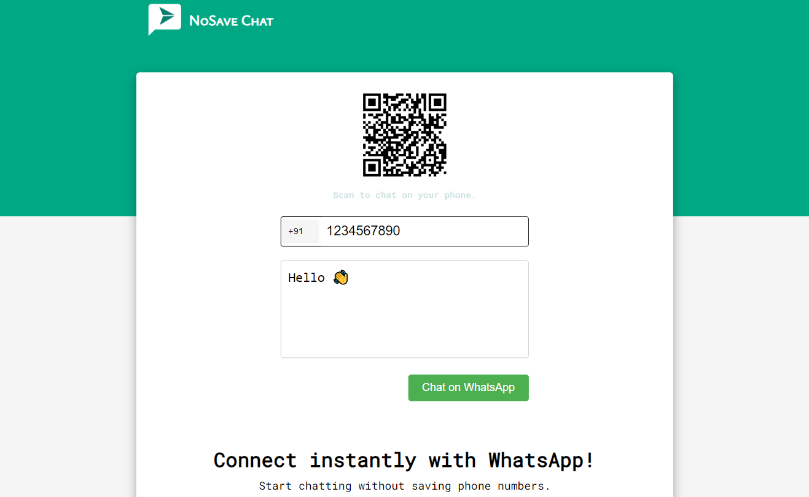

### How to Use?

1. Enter the phone number you want to chat with.
2. Type your message in the text box at the bottom.
3. Click the "Chat on WhatsApp" button to redirect to WhatsApp and start the chat.

### Install the App

